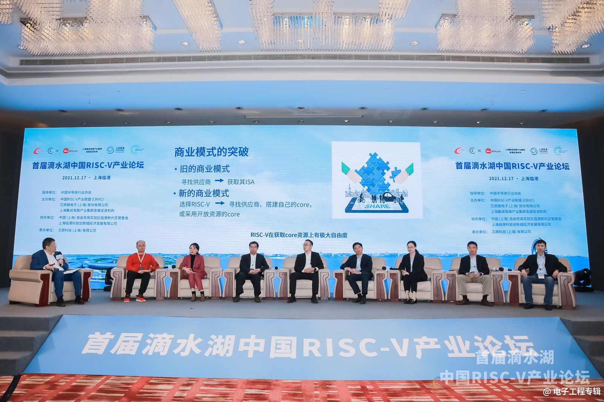
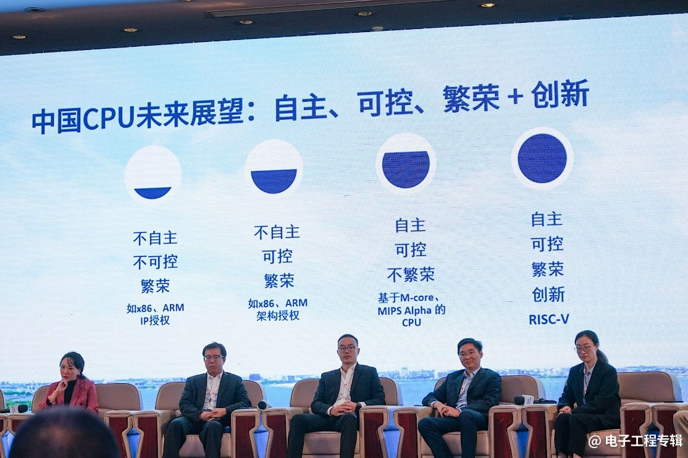
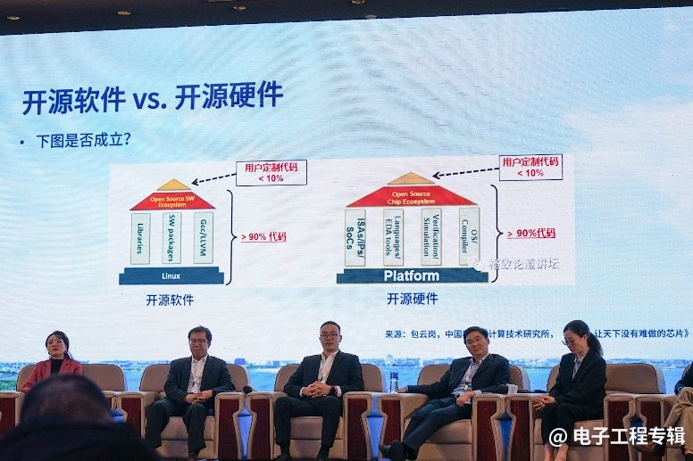
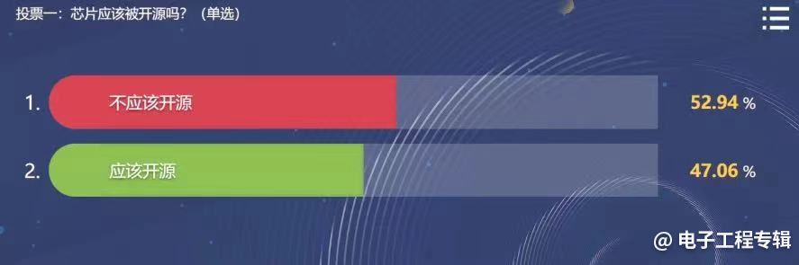
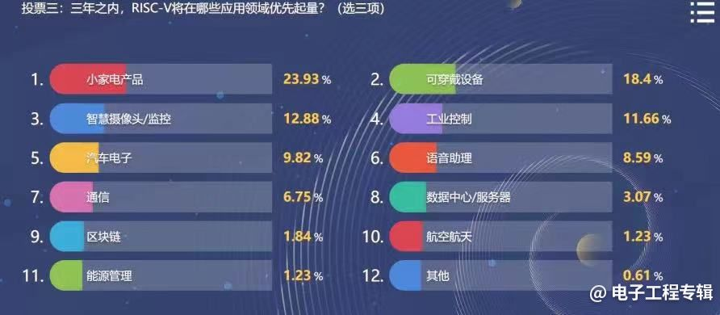
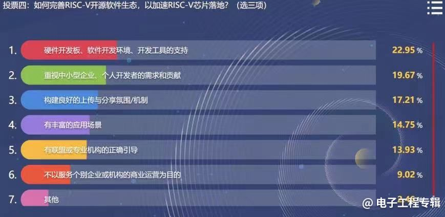

谈到开源，大多数人首先想到的是开源软件，例如Linux、Apache、MySQL、Python等。但是开源硬件大家却了解得不多，如果说开源软件是将软件的源代码公开出来，那硬件要怎么开源呢？维基百科对开源硬件的定义是“以与自由及开源软件相同的方式设计的计算机及电子硬件，这个词主要是用来反映自由释放详细信息的硬件设计，如电路图、材料清单和电路板布局数据等，通常开源硬件也使用开源软件来驱动”。

具体到芯片领域，一颗完整的芯片由各种IP核组成。就像搭积木一样，即便这些IP你都认识，如果要用这些“预制件”搭成你想要的芯片仍需支付一定的版权费用。以IP核销售模式的发明者Arm为例，他们自己并不生产特定芯片，而是通过出售芯片技术授权，建立起新型的微处理器设计、生产和销售商业模式。

**这种模式算不算开源？显然不是；有没有指令集开源的处理器架构？有，就是RISC-V。**

RISC-V是加州大学伯克利分校（UCBerkeley）设计的第五代精简指令集计算机（RISC）架构，始于2010年。RISC-V适用于从微控制器到超级计算机等各层次的计算系统，支持自定义扩展指令，标准由非盈利RISC-V组织维护。之前的四代RISC-处理器也均由UCBerkeleyDavidPatterson教授带领研制，包括1981年的一代、1983年的二代、1984年的三代（SOAR）、1988年的四代（SPUR）。

对于目前致力于实现自主可控的中国半导体领域来说，IP最薄弱的环节正在于处理器。业内使用数量最多两大的处理器架构x86和Arm，前者牢牢掌握在英特尔手中，后者也需要授权付费使用，RISC-V能否成为中国CPU产业的希望？大家都迫切地想知道这个问题的答案。

## RISC-V IP核开源，就能做出商业化的处理器吗？

日前，在由中国*RISC-V产业联盟*、*芯原微电子*和*上海集成电路产业集群发展促进机构*共同主办的首届**滴水湖中国RISC-V产业论坛**上，进行了一次主题为**“RISC-V的开放与开源”**的圆桌讨论。中国RISC-V产业联盟理事长、芯原股份创始人、董事长兼总裁戴伟民博士担任主持，来自RISC-V领域领先的三大IP供应商高层、在开源软件和生态领域负有盛名的机构专家，以及来自芯片领域的企业高层代表一同探讨了`芯片是否该被开源`、`RISC-V开源软件生态`、`RISC-V芯片产业化`等一系列相关的话题。台下与线上的嘉宾也踊跃参与了部分话题的投票，表达了自己的观点，与台上嘉宾进行了实时互动。

上图由左到右依次为**：**戴伟民博士，红帽高级软件工程师、RISC-V国际基金会大使傅炜，工信部绿色计算产业联盟CTO郭晶，北京晶视智能科技有限公司COO黄群辉，博流智能科技（南京）有限公司市场营销副总裁刘占领，平头哥半导体有限公司副总裁孟建熠，芯来科技联合创始人CEO彭剑英，赛昉科技有限公司联合创始人兼CEO徐滔，成都启英泰伦科技有限公司副总裁张来

戴伟民首先介绍了RISC-V开发的初心，作为2010年Berkeley实验项目的一部份，当时实验人员的要求是开发出一个“易于实施、高效、可扩展且可与他人分享不受限制”的指令集。但当时没有一个现成的指令集能够满足所有要求，所以他们创造了RISC-V。

在此之前，处理器行业的旧商业模式是先寻找供应商，再获取其指令集架构（InstructionSetArchitecture，ISA），正如上面提到的Arm模式。但因为这样的模式授权费用较高，业内有很多人抱着UCBerkeley一样同样的想法和需求，所以2014年RISC-V一经推出便快速获得大量认同。与此同时也带来了商业模式的改变，新的模式是“选择RISC-V，再寻找供应商、搭建自己的core，或采用开放资源的core”。

**虽然RISC-V在获取core资源上有极大自由度，但仅凭这样就能做出商业化的处理器产品吗？**

如果用写作文来打比方，指令集就好比字典，开放指令集就相当于你可以随意翻字典，但要用这些看到的内容组成一篇作文，还需要自己有写作能力。所以**RISC-V的指令集开源并不代表开放硬件**，还需要有针对特定片上系统的独特指令才能真正做出能用的芯片。这还涉及到RISC-V的三个层次：

1. `基准指令`。约有40多条，已经固化不变；
2. `标准扩展指令`。一套标准的可选扩展指令，能够持续演化并重复使用；
3. `专用指令`。一般是用户专为特定片上系统设计的独特指令，无需考虑复用性，但各家可对其进行专利保护，这正是当前RISC-V芯片设计的关键，也是行业争论的热点。

回到中国芯片产业的问题上，国家对CPU未来的展望大概可以归纳为：`自主`、`可控`、`繁荣+创新`。当前主流的CPU架构x86、Arm需要国外授权使用，虽然繁荣但既不自主又不可控；如果资本充足，可以实现x86和Arm的架构授权，达到了可控，但仍不自主；其实之前也有自主可控的M-core、MIPSAlphaCPU，但是很小众，不繁荣。“唯独RISC-V是我认为迄今为止，既自主、可控又繁荣的架构，还可以鼓励创新。所以我们一开始就支持这个架构，从2018年7月上海市经信委出扶植政策，到2019年成立中国RISC-V产业联盟(CRVIC)，现在已经有140多家会员单位。”戴伟民说到。

*《2021年度中国IC设计调查》开始了！本调查针对中国IC设计公司专业人士进行，包括EDA/IP/IC设计、设计重心与制造工艺、个人发展和工作习惯相关问题四个部分，仅限中国本土IC公司工程师参与，完善信息参与调查将有机会获得最新半导体行业魔法书《观点》！ 点击链接参与调查：[http://emediasurvey.mikecrm.com/89t6f5q](https://www.icspec.com/news/article-details/1932608#)*

## 开源不开放，开放不开源

鉴于不少人都认为，RISC-V开源了就能用它免费做芯片，圆桌的第一个问题就是要厘清“开源”和“开放”。

- **开源：**开源指系统内部代码完全开放，用户可以按照需求更改或添加相应功能；
- **开放：**指提供标准化环境的基础平台，允许不同功能和不同开发商的软、硬件模块介入。

**所以，开源不等于开放——开放可以不开源，开源可以不开放。**

傅炜在开源软件行业工作多年，RISC-V出来之后他非常支持，他的态度是：只有以开放的态度去做开源才是有意义的。他曾购买的某品牌安卓手机，厂家虽然把Linux系统数据手册公开了，但用户没有内核源码无法用它刷机，这就是“开源但不开放”。

刘占领也形象地解释了开源和开放。比如装修样板房的开源，是大家都可以去看去拍照，只不过有些拍照是免费的，有些是收费的；而开放更多是标准上的开放，比如地板砖尺寸的选择由大家自己来定。“开放不开源”的典型案例就是Wi-Fi芯片开发中出售基于IP源代码的行为，把Wi-Fi协议栈全部开放，但是芯片公司并不一定每一家都能做得出来；“开源不开放”的典型案例是RTOS，每一家操作系统都是RTOS框架，但标准很难统一。

如果看开源软件的定义，“开源软件是指将源代码和软件程序公开，用户可以免费试用，并在此基础上进行自由修改、重新发布和创建衍生品”。

那么芯片的“开源不开放”，就是指半导体IP软核开源，但是用户不能改；“开放不开源”，就像苹果的很多开放架构，但是里面都不开源；“开源又开放”的例子目前只有Linux、安卓和红帽等软件。

戴伟民用一张图，展示了用开源软件的理念，去做开源硬件的构想。开源软件的做法是90%代码开源，用户写只写10%定制代码。硬件如果也90%开源，用户只做10%定制芯片就出来了。但这样做真的可行吗？

## 芯片应该被开源吗？

一款芯片的开源应该包括很多要素，包括**开源架构**、**开放免费共同定制**、**开放设计流程**、**公开文档**、**开源EDA工具**以及**开放源码**。戴伟民的观点是硬件开源和软件开源不一样，**软件要开源，而硬件要开放**，硬件开源只适用于学校和研究单位等非赢利性机构。

圆桌论坛上发起的第一个投票问题是：芯片应该被开源吗？现场观众和嘉宾选择的结果是：

A、不应该开源。（52.94%）

B、应该开源。（47.06%）

徐滔的观点也是“不应该开源”，他认为大家对于“开源”的理解存在误区，”开源从来不是目的、而是手段、是一种商业模式。软件开源之所以成功，是因为很多公司因此获得了实质性的利益，这些公司共同推动了软件开源。而硬件开源最大的问题是：“我开源后谁得利了？谁又有驱动力去推动硬件开源？”可能需要比整个产业还要高一层次的机构。

孟建熠也赞同徐滔的观点，他进一步表示，推动开源软件发展的无非两类公司：

1. 硬件公司。很多底层的芯片公司产品需要与操作系统和在软件结合，发展“软硬融合”的生态；
2. 第三方软件公司。

”硬件开源的核心问题是：如果开源，谁来买单？“孟建熠说到，”软件开源有硬件公司、互联网公司来买单，硬件开源谁来做商业化？今天来讨论芯片开源，我认为还过早，但确实有人已经在尝试。“

据悉，平头哥自己也在做一些相关尝试，并找到了一些方向。孟建熠认为芯片产品不需要开源，因为就算是竞争对手也不会直接拿来用，但他认为开源有两个好处：一是学校、研究所培养学生创新时，开源对于学生非常友好；二是看到未来的方向，硬件未来需要更多的算法迭代，所以软硬件算法打通后会发挥更大的效能。

彭剑英认为，在开放不开源的问题上，RISC-V就像Wi-Fi、蓝牙一样，开放的目的是希望把RISC-V变成国际标准，读懂标准并不一定意味着可以实现RISC-VCPU。”技术没有界限，开不开源更多考虑的是商业模式。

开源硬件跟开源芯片其实也是不同的概念。彭剑英以树莓派、安卓开源平台举例，树莓派上的芯片其实是博通定制的并不开放，这里大家平时认为的“树莓派就是开放或开源”，很多概念被混淆了。芯片产业链很长，一个指令集或处理器的开源并不能解决“开源芯片”的所有问题，商业逻辑上应该是提供成熟的IP或者设计方法、平台，去快速的帮助客户做芯片的迭代。

## RISC-V将在哪些应用领域优先起量？

谈到适合RISC-V的应用领域，戴伟民谈到了**碎片化**和**多样化**两个概念。所谓碎片化，就是用不同的方法做同样的事情；而多样化，则注重解决不同的问题。RISC-V的出现，为广阔的应用市场提供了创新机遇——在云和数据中心领域，亚马逊、阿里巴巴等开始布局自己的芯片；移动设备领域，加速了创新升级、迭代和海量市场的发现；汽车领域的娱乐、安全、自动驾驶等等。

所以现场发起的第二个问题是：三年之内，RISC-V将在哪些应用领域优先起量？投票结果如下：

*排名前三的是：1、小家电产品。2.可穿戴设备。3.智慧摄象头/监控。*

黄群辉从芯片行业的角度分析，认为应该考虑两个维度：**一是量**，**二是芯片的产业影响力**。

从体量来看，产品的市场容量越大，机会也越大。**穿戴式设备与小家电两个品类之所以非常适合RISC-V是因为系统相对较封闭**，没有太多基于RISC-V生态的问题。”安防选项虽然排第三位，但是如果从影响力来说却不输前两项。”

刘占领表示，起量意味着这个市场已经存在，要谈的是RISC-V的渗透率，而从“渗透”维度来讲，他认为要快速起量有三个条件很重要:

- 第一，产业链越短越可控，越容易起量。
- 第二，客户关注RISC-V的原因，无非是好用便宜等性价比因素。
- 第三，易用性，参考原来用Arm架构时的快速移植，产品基础段位越低越容易实现。再加上IP厂家完整的工具链，也能够有效产生协同效果，所以刘占领认为在技术需求偏低的RTOS产品领域会先起量。

## 完善RISC-V开源软件生态

生态对于处理器架构来说太重要了，RISC-V能否借鉴开源软件成功的经验，来完善自己的软件生态呢？对此傅炜介绍了红帽的经验，就是保持开放的态度去做开源。

据介绍，Fedora是一个受红帽支持、由社区驱动的Linux发行版，是新功能新特性的培养皿。被认为稳定且对企业版有用的特性将被合入RHEL发行版，发布周期很短（约6个月），红帽所有产品都是以Fedora开源产品为基础。RHEL是企业版本，适合关注系统稳定性的公司，红帽官方提供技术支持，但发布周期稍长，维护周期长，并且不提供二进制。”这个商业模式就是这样，如果二进制能够随意获得的话，红帽就养不起这么多工程师了。但红帽一直想要回馈工程师，所以有了后来的CentOSLinux。”这是完全基于RHEL源码的重编译版本，红帽官方不提供技术支持，故不适用于无法自行维护系统的用户。

现场投票的第三个问题是：如何完善RISC-V开源软件生态，以加速RISC-V芯片落地。

*获得前三的选项分别是：1、硬件开发板、软件开发环境、开发工具的支持。2、重视中小型企业、个人开发者的需求和贡献。3.构建良好的上传与分享氛围/机制。*

郭晶曾运营过Linaro，这是2010年3月由Arm、飞思卡尔、IBM、Samsung、ST-Ericsson及TI等半导体厂商联合设立的非盈利性组织，注册于英国。公司使命是不断改进与优化开源Linux软件产品及开发工具，以帮助Arm合作伙伴快速推出基于Arm架构的产品。她从生态运营和商业模式角度，强调了“意识形态”的问题，因为开源生态需要非常开放的技术交流环境，一定程度上从业者需要放下壁垒、秉承“中立、开放、国际化”的宗旨。

“生态本身就是搭台子，如果不能中立和开放地去和有先进经验的开源社区、海外开源工程师们持续交互的话，台子是搭不起来的，也很难持久下去。”谈到开源生态产业，郭晶认为有两个主要的角色：一是开源生态的搭建者，二是开源生态的使用者，同时也是开源生态的参与者、伙伴。

过去十年中国ICD半导体行业中，形成了以OEM为代表和以互联网出身为代表的两类团队，非常深入地参与到开源生态中并获得一定成果。他们旗下大量的硬件产品逐渐扩张、爆发，形成了一定用户黏性，同时他们对自身品牌也有认知。

随着从端到云以及云延伸技术的发展，行业对于基础架构的依赖和希望在一定程度上实现可控的需求，正变得越来越迫切。上述两类公司都已经在发展自己的开源生态，但更多是采用“开源不开放”的搭自己台子模式，最典型的案例就是华为鸿蒙。过去几年间，Linaro在底层软硬件开放平台和工具搭建，以及针对Linux内核的持续维护更新，对华为的成功起到了推进作用，然而即便华为已经取得了一定成果，他们仍需要强依赖和捆绑更中立的开源社区，才能持续对代码维护和更新。

那么开源的组织方、开源生态公司，又是怎样去搭建生态的呢？郭晶表示，“我很荣幸已经经历过1.0时代，也在深度思考怎么样进入到2.0时代，希望能把这样的形态和组织形式更持久地发展壮大下去。”要做到这一步，除了纯粹靠厂商资助、靠国家队政府滋养之外，还需要有长久的商业价值实现自我造血功能；除了从西方去引进、消化、吸收，更需要找到更适合中国、更接地气的方式。

造血上，郭晶认为需要开发、维护所有生态参与方共同的重复性标准化需求，主要针对面向SoC与操作系统、底层DSP、软硬件平台、工具搭建以及维护。这也是各个核心厂商需要长期培养的基础软硬件核心能力，需要真正的投入人财物。“人”就是每家都应该投入一定的工程力量去做协同开发，掏出费用或由统一资助方资助这样的专业运营和独立团队，“物”就是大家要拿出自己的芯片、平台和模块板子参与协同开发以及集中性的验证和测试。

十年前Linaro这个非常特别的生态公司就是这样诞生的，上面说到那些国际先进芯片公司之所以要做这件事，正是因为他们在十年前遭遇到了Arm生态碎片化的痛点，只有大家求同存异，派出各自的CTO和首席架构师共同探讨才能解决。“这一点我觉得我们完全可以吸收再利用。”郭晶说到。

至于怎样寻求自我造血和长期商业价值，参考已经渗透到各行各业的软件应用会发现，用户需求其实也变得更多样化、复杂化。以往软件的迭代周期是一年或半年，现在是每小时为单位的更新诉求。所以从软件的开发到上线后的维护，整个研发管理流程和组织架构都要求达到更高的一体化，要用更专业的商业运营组织形态来管理。尤其是商业化开源公司，怎样把握软件功能中一定的开源比例，对今后的商业化运作非常重要。针对某个强技术功能做深度定制化服务，也是走商业化路径可以思考的一个方向。

